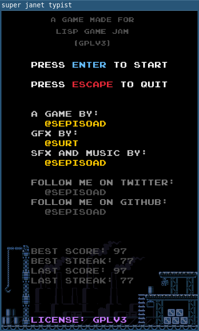

# super-janet-typist

a short typing game made with janet lisp

by [@sepisoad](https://twitter.com/sepisoad)

## screenshot(s)

## how to build

you need to have raylib installed on your system

type `make` 

type `engine`

## credits

all the pixel arts are authored by [surt](http://uninhabitant.com/)
