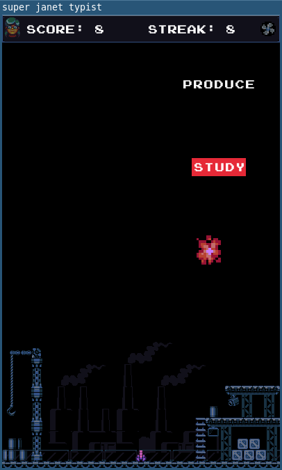

# super-janet-typist

a short typing game made with janet lisp

by [@sepisoad](https://twitter.com/sepisoad)

## screenshot(s)

## how to build

you need to have raylib installed on your system

run `make` and it will build the game for you

## credits

all the pixel arts are authored by [surt](http://uninhabitant.com/)

[raylib](https://github.com/raysan5/raylib) is used as framework

[rFXGen](https://github.com/raysan5/rfxgen) is used to generate SFXs

[pixitracker](https://www.warmplace.ru/soft/pixitracker/) is used to make music.

